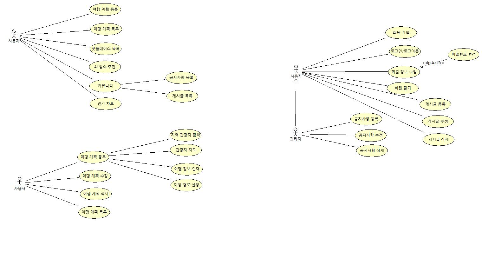
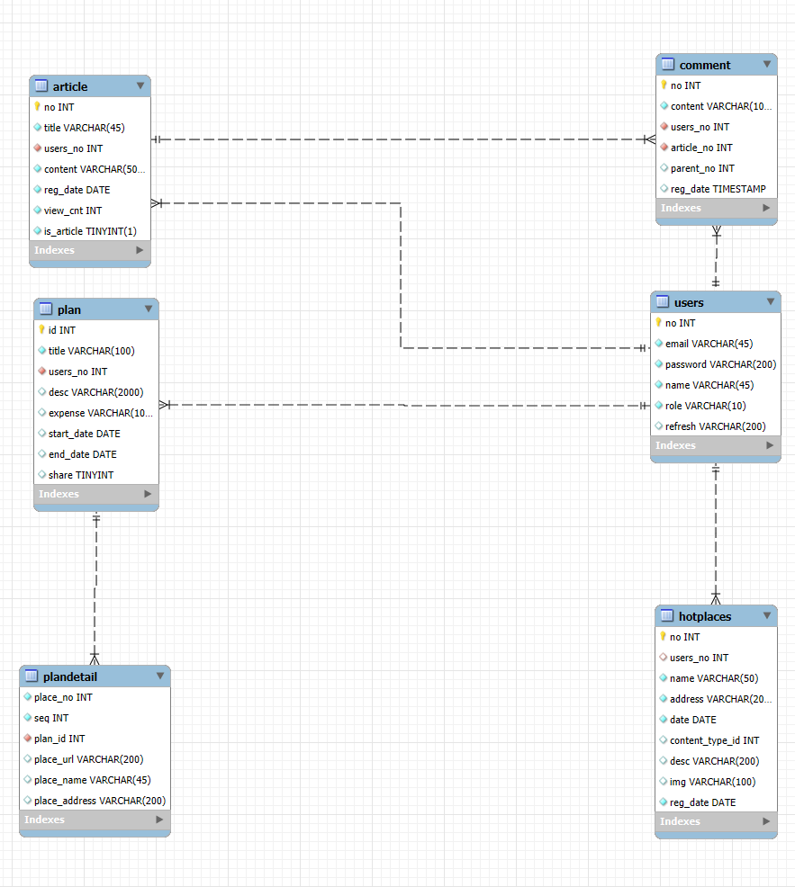
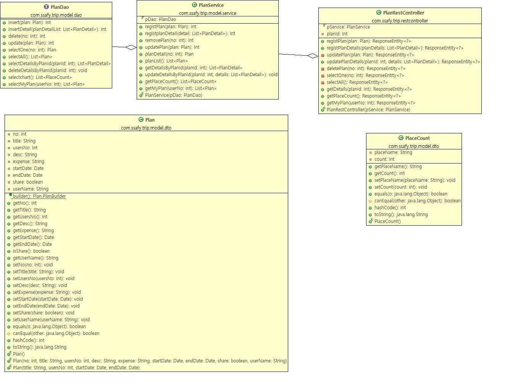
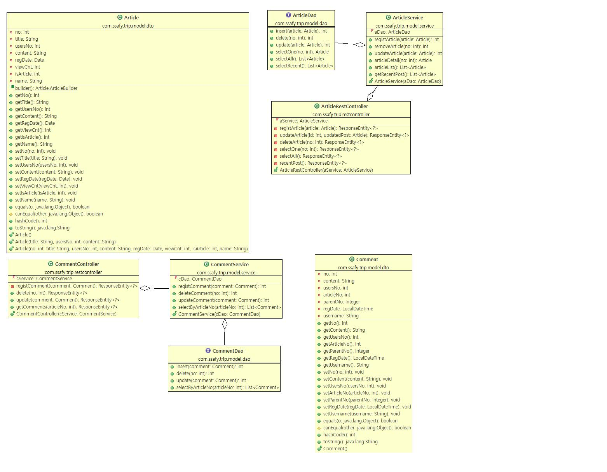

# WANDARY 프로젝트

## 설계서

### 요구사항 정의서

| 순번 | 요구사항명                          | 요구사항 상세                                                  |
| ---- | ----------------------------------- | -------------------------------------------------------------- |
| 1    | 지역별 관광지 정보 수집             | 지역별 관광지 정보를 얻어와 화면에 표시                        |
| 2    | 관광지, 숙박, 음식점 조회           | 관광지 정보를 지역별 원하는 컨텐츠 별 조회                     |
| 3    | 문화시설, 공연, 여행코스, 쇼핑 조회 | 관광지 정보를 지역별 원하는 컨텐츠 별 조회                     |
| 4    | 여행 계획 경로 설정                 | 조회한 관광지를 활용하여 여행 계획, 여행 경로를 저장           |
| 5    | 회원 주도의 HotPlace 등록           | 지도와 사진을 활용한 HotPlace 등록                             |
| 6    | 회원 관리                           | JWT와 Spring Security를 통한 회원가입, 수정, 조회, 탈퇴        |
| 7    | 로그인 관리                         | JWT와 Spring Security를 통한 로그인 / 로그아웃 / 비밀번호 찾기 |
| 8    | 공지사항                            | 공지사항 등록, 수정, 삭제, 조회                                |
| 9    | 공유게시판                          | 게시판 등록, 수정, 삭제, 조회                                  |
| 10   | 여행 계획                           | 여행 계획 등록, 수정, 삭제, 조회                               |
| 11   | 인공지능 서비스                     | ChatGPT API를 활용한 서비스 제공                               |

## Use Case Diagram

## ERD

## 클래스 다이어그램

### 여행 계획 클래스 다이어그램

### 게시판 클래스 다이어그램

---

# 화면 설계서

## 메인 페이지

.png>)

.png>)

.png>)

---

## 여행 계획 등록 페이지

.png>)

.png>)

.png>)

---

## 여행 계획 목록 페이지

.png>)

---

## 여행 계획 상세 페이지

.png>)

---

## 여행 계획 수정 페이지

.png>)

.png>)

---

## 게시글 목록 페이지

.png>)

---

## 게시글 상세 페이지

.png>)

---

## 게시글 수정 페이지

.png>)

---

## 핫플레이스 목록 페이지

.png>)

---

## 핫플레이스 상세 페이지

.png>)

---

## AI 관광지 추천 페이지

.png>)

---

## 로그인 페이지

.png>)

### 회원가입 페이지

.png>)

### 비밀번호 수정 페이지

.png>)

---

## 인기 여행지 차트

.png>)

---

## 내 여행 계획 목록

.png>)
